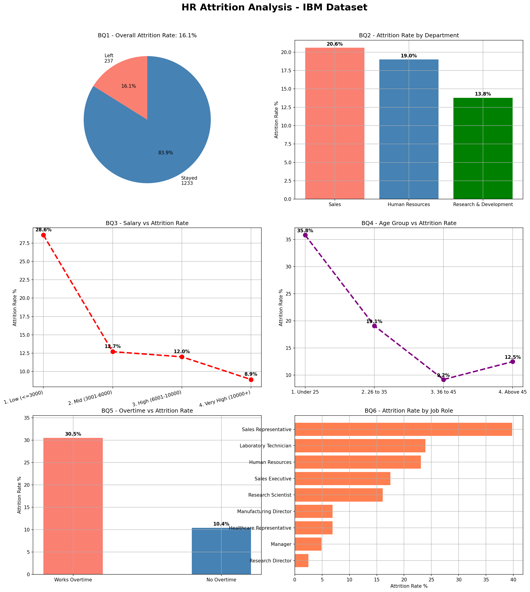

# hr-attrition-analysis 

## Objective
Analyzed IBM HR dataset of 1,470 employees to identify key drivers
of employee attrition and recommend HR retention strategies.

## Business Questions
| # | Question |
|---|----------|
| BQ1 | What is the overall attrition rate? |
| BQ2 | Which department has highest attrition? |
| BQ3 | Does salary affect attrition? |
| BQ4 | Does age group affect attrition? |
| BQ5 | Do overtime employees leave more? |
| BQ6 | Which job role loses most employees? |

## Key Insights
- Overall attrition rate is 16.12%
- Sales department has highest attrition at 20.63%
- Low salary employees leave at 28.61% vs 8.90% for high salary
- Overtime employees are 3x more likely to leave at 30.53%
- Sales Representatives have highest attrition at 39.76%
- Employees under 25 have highest attrition at 35.77%

## Tools Used
Python · pandas · numpy · matplotlib · MySQL 

## Dashboard

## Dataset
IBM HR Analytics Employee Attrition from Kaggle
